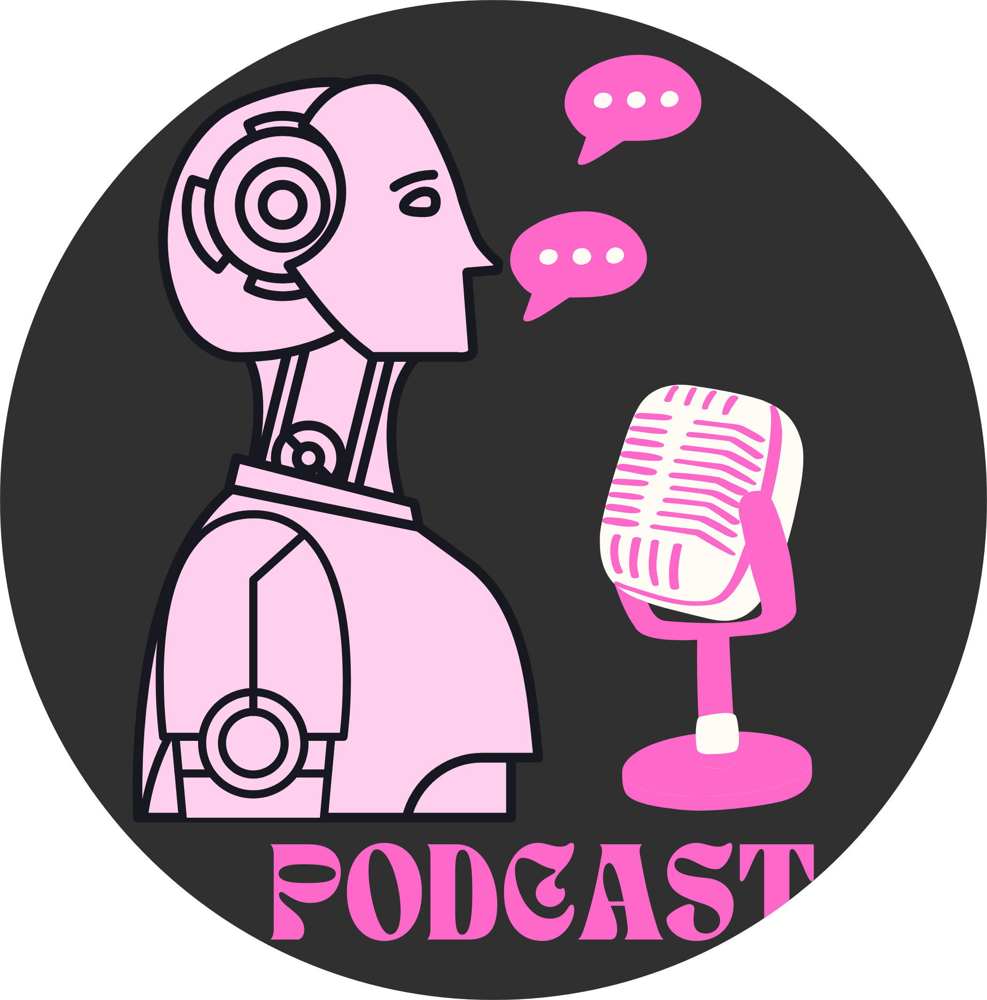

# dio-desafio-podcast

DevForGirls 🎙️💻
Ei! Meu nome é Catharina, e eu criei o DevForGirls como parte de um desafio da DIO, que tem o objetivo gerar um podcast utilizando ferramentas de IA através de promps mais detalhado.
É um podcast feito com muito carinho para meninas que estão começando no mundo do desenvolvimento frontend. A ideia é trazer dicas, curiosidades e inspirações de uma forma simples, divertida e acolhedora, pra mostrar que programação também é lugar pra gente! 🌟

🎧 O que você encontra no DevForGirls?
Curiosidades sobre CSS : Coisas legais e criativas para deixar seus projetos mais bonitos.
Ferramentas para frontend : Descubra plataformas que vão facilitar sua vida no dia a dia.
Dicas práticas : Aprenda conceitos importantes de um jeito leve e descomplicado.
Muito incentivo e diversão : Porque a gente merece aprender se divertindo!

✨ Por que eu criei o DevForGirls?
Eu sei como é tentar dar os primeiros passos em tecnologia, e criar queria algo que ajudasse meninas a não se sentirem sozinhas nessa jornada. O DevForGirls é mais que um podcast: é um espaço pra gente aprender, se inspirar e crescer juntas, sem complicação e com muito apoio!

💡 Como foi feito?
Como estudante, eu queria mostrar o que dá pra criar coisas incríveis com as ferramentas certas, então usei:

Roteiro gerado via ChatGPT : Porque ter uma ajuda pra organizar as ideias sempre é bom.
Áudio gerado pela ElevenLabs : Pra criar a voz da apresentadora de forma natural e cativante.
Canvas : Pra fazer as capas e deixar tudo visualmente bonito.
CapCut : Pra editar o áudio e adicionar músicas de fundo e efeitos sonoros.

